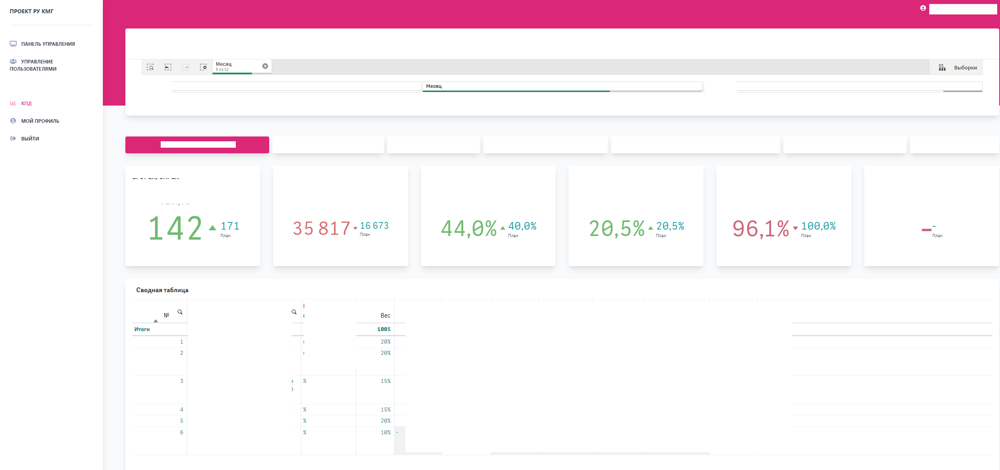

## Laravel project with Qlik Sense charts using Capability API
- Laravel project generated from https://quickadminpanel.com/ (Livewire + TailwindCSS) and modified
- Auth method changed to LDAP https://ldaprecord.com/
- QlikSense connection variables are in env file
- QlikSense charts called in views

## Installation
1. Edit .env
2. composer install
3. npm install
4. php artisan migrate --seed
5. php artisan key:generate
6. npm run dev

Default
Username: admin@admin.com
Password: password

